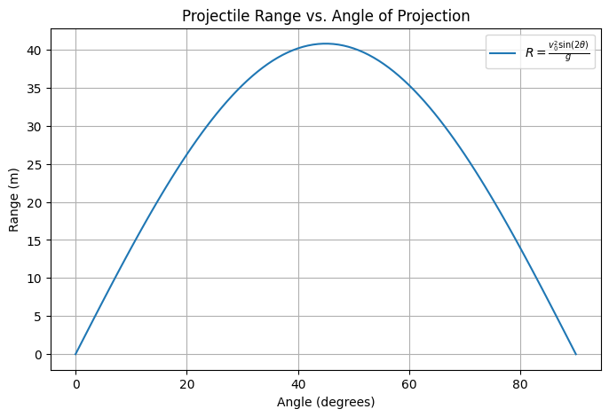

# Problem 1
# Investigating the Range as a Function of the Angle of Projection

## Step 1: Understanding Projectile Motion

Projectile motion follows two independent components:
1. **Horizontal Motion**: Moves at constant velocity.
2. **Vertical Motion**: Affected by gravity.

Ignoring air resistance, we assume:
- Initial velocity: $v_0$
- Launch angle: $\theta$
- Gravity: $g$

The goal is to find how the range depends on $\theta$.

---

## Step 2: Deriving the Equations of Motion

Using kinematic equations:

### Horizontal Motion:
- Initial horizontal velocity:  
  $$
  v_{x0} = v_0\cos(\theta)
  $$
- Horizontal displacement at time $t$:  
  $$
  x(t) = v_0\cos(\theta) t
  $$

### Vertical Motion:
- Initial vertical velocity:  
  $$
  v_{y0} = v_0\sin(\theta)
  $$
- Vertical displacement at time $t$:  
  $$
  y(t) = v_0\sin(\theta) t - \frac{1}{2}gt^2
  $$

The projectile reaches the ground when $y = 0$. Solving for $t$:

$$
t_f = \frac{2v_0\sin(\theta)}{g}.
$$

---

## Step 3: Calculating the Range

The range is the horizontal distance traveled before landing:

$$
R = x(t_f) = v_0\cos(\theta) t_f.
$$

Substituting $t_f$:

$$
R = v_0\cos(\theta) \times \frac{2v_0\sin(\theta)}{g}.
$$

Using $\sin(2\theta) = 2\sin(\theta)\cos(\theta)$:

$$
R = \frac{v_0^2\sin(2\theta)}{g}.
$$

---

## Step 4: Analyzing the Range Equation

1. **Effect of Angle**:
   - Maximum range occurs when $\sin(2\theta) = 1$, i.e., $\theta = 45^\circ$.
   - The function is symmetric about $45^\circ$, meaning angles like $30^\circ$ and $60^\circ$ yield the same range.

2. **Effect of Initial Velocity**:
   - Range increases quadratically with $v_0$.

3. **Effect of Gravity**:
   - Increasing $g$ decreases range, as expected in stronger gravitational fields.

---
```py
import numpy as np
import matplotlib.pyplot as plt

# Parameters
v0 = 20  # Initial velocity (m/s)
g = 9.81  # Gravitational acceleration (m/s^2)
angles = np.linspace(0, 90, 100)  # Angles from 0 to 90 degrees
radians = np.radians(angles)  # Convert to radians

# Compute range
ranges = (v0**2 * np.sin(2 * radians)) / g

# Plot results
plt.figure(figsize=(8, 5))
plt.plot(angles, ranges, label=r"$R = \frac{v_0^2\sin(2\theta)}{g}$")
plt.xlabel("Angle (degrees)")
plt.ylabel("Range (m)")
plt.title("Projectile Range vs. Angle of Projection")
plt.legend()
plt.grid()
plt.show()
```


## Step 5: Practical Applications

- **Sports**: Finding the best angle for throwing a javelin or soccer ball.
- **Engineering**: Estimating landing zones for projectiles.
- **Astronomy**: Calculating trajectories of objects in space.

---

## Step 6: Model Limitations

- **No Air Resistance**: Real-world projectiles experience drag, which shortens the range.
- **Different Heights**: If launched from or landing on different heights, calculations must be adjusted.
- **Wind Effects**: Wind can increase or decrease range unpredictably.

For greater accuracy, numerical methods (e.g., solving differential equations with drag) are required.
