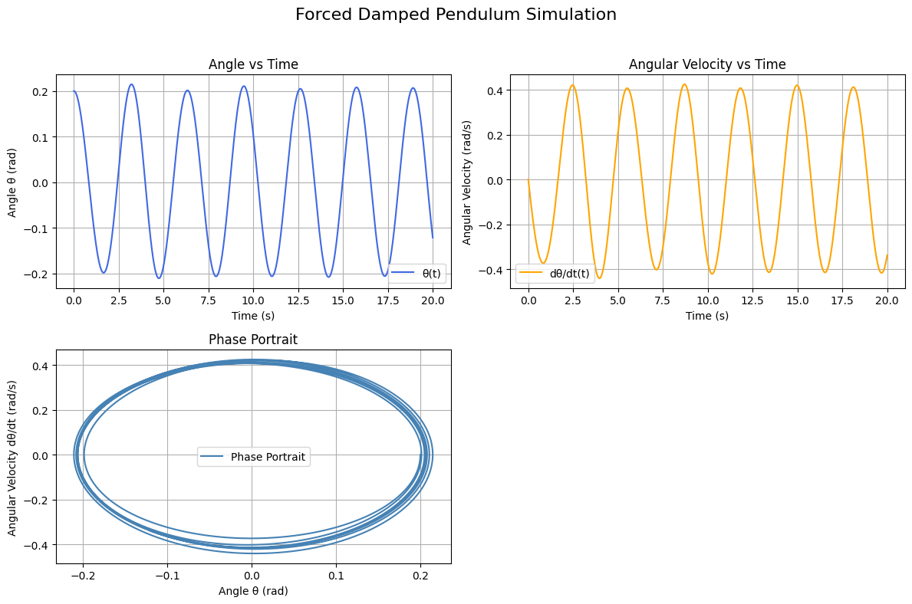

# Problem 2

## Step 1: Theoretical Foundation

We consider the equation for a forced damped pendulum:

$$\frac{d^2\theta}{dt^2} + b\frac{d\theta}{dt} + \frac{g}{L}\sin\theta = A\cos(\omega t)$$

This includes damping $b$, gravity $g$, length $L$, and periodic forcing $A\cos(\omega t)$.
To solve it numerically, we rewrite it as a system of first-order ODEs.

---

## Step 1.1: Approximate Solution for Small-Angle Oscillations

To simplify the analysis, we consider the small-angle approximation:

$$\sin\theta \approx \theta$$

Substituting this into the original equation gives a linear second-order nonhomogeneous differential equation:

$$\frac{d^2\theta}{dt^2} + b\frac{d\theta}{dt} + \frac{g}{L}\theta = A\cos(\omega t)$$

This is a standard linear ODE with constant coefficients and a cosine forcing term. The general solution consists of two parts:

### 1. Homogeneous Solution

Solve the homogeneous equation:

$$\frac{d^2\theta}{dt^2} + b\frac{d\theta}{dt} + \frac{g}{L}\theta = 0$$

Assume a solution of the form $\theta_h(t) = e^{\lambda t}$:

Then:

$$\lambda^2 + b\lambda + \frac{g}{L} = 0$$

Solve the characteristic equation:

- If the discriminant $D = b^2 - 4\frac{g}{L} > 0$: overdamped
- If $D = 0$: critically damped
- If $D < 0$: underdamped (oscillatory), which gives:

$$\theta_h(t) = e^{-\frac{b}{2}t}(C_1\cos(\omega_0 t) + C_2\sin(\omega_0 t))$$

where:

$$\omega_0 = \sqrt{\frac{g}{L} - \frac{b^2}{4}}$$

### 2. Particular Solution

Assume a solution of the form:

$$\theta_p(t) = B\cos(\omega t) + C\sin(\omega t)$$

Plug into the ODE and match coefficients. After simplification:

The steady-state solution is:

$$\theta_p(t) = \frac{A}{\sqrt{(\frac{g}{L} - \omega^2)^2 + (b\omega)^2}} \cos(\omega t - \delta)$$

where the phase shift $\delta$ is given by:

$$\tan(\delta) = \frac{b\omega}{\frac{g}{L} - \omega^2}$$

### Final Approximate Solution:

Combining both parts:

$$\theta(t) = \theta_h(t) + \theta_p(t)$$

In the long term, the homogeneous part decays due to damping, and the system reaches a steady-state periodic solution with amplitude and phase depending on $A$, $b$, $\omega$, and $\frac{g}{L}$.

This approximation is useful for analyzing resonance and predicting the system’s response under small displacements.

---

## Step 2: System of Equations. Analysis of Dynamics:

Let:

$x_1 = \theta$  
$x_2 = \frac{d\theta}{dt}$

Then:

$$\frac{dx_1}{dt} = x_2$$  
$$\frac{dx_2}{dt} = -b x_2 - \frac{g}{L} \sin(x_1) + A \cos(\omega t)$$

## Step 3: Angle and Phase Space Simulation


The forced damped pendulum model is relevant to various engineering and physical systems. Some real-world examples include:

- **Energy harvesting systems**, where mechanical vibrations are converted into electrical energy using oscillating parts.
- **Suspension bridges**, where damping and periodic forces play a role in stabilizing the structure under wind or traffic loads.
- **Oscillating electrical circuits** (e.g., RLC circuits), which behave analogously to mechanical oscillators with damping and driving forces.
- **Biomechanics**, such as modeling the motion of limbs or joints under muscle activation and external load.

---

## Step 4: Poincaré Section
Python Code: Combined Pendulum Plots (θ(t), ω(t), Phase Portrait)
python
```python
import numpy as np
import matplotlib.pyplot as plt
from scipy.integrate import solve_ivp

# Parameters
g = 9.81
L = 1.0
b = 0.3
A = 1.2
w = 2.0

# Initial conditions
theta0 = 0.2
omega0 = 0.0
y0 = [theta0, omega0]

# Time setup
t_start = 0
t_end = 20
num_points = 5000
t_vals = np.linspace(t_start, t_end, num_points)

# Define the system
def pendulum(t, y):
    theta = y[0]
    omega = y[1]
    dtheta_dt = omega
    domega_dt = -b * omega - (g / L) * np.sin(theta) + A * np.cos(w * t)
    return [dtheta_dt, domega_dt]

# Solve the system
sol = solve_ivp(pendulum, [t_start, t_end], y0, t_eval=t_vals)

theta = sol.y[0]
omega = sol.y[1]
time = sol.t

# Plot results in subplots
fig, axs = plt.subplots(2, 2, figsize=(12, 8))
fig.suptitle('Forced Damped Pendulum Simulation', fontsize=16)

# θ(t)
axs[0, 0].plot(time, theta, label='θ(t)', color='royalblue')
axs[0, 0].set_title('Angle vs Time')
axs[0, 0].set_xlabel('Time (s)')
axs[0, 0].set_ylabel('Angle θ (rad)')
axs[0, 0].grid(True)
axs[0, 0].legend()

# ω(t)
axs[0, 1].plot(time, omega, label='dθ/dt(t)', color='orange')
axs[0, 1].set_title('Angular Velocity vs Time')
axs[0, 1].set_xlabel('Time (s)')
axs[0, 1].set_ylabel('Angular Velocity (rad/s)')
axs[0, 1].grid(True)
axs[0, 1].legend()

# Phase portrait: ω vs θ
axs[1, 0].plot(theta, omega, label='Phase Portrait', color='steelblue')
axs[1, 0].set_title('Phase Portrait')
axs[1, 0].set_xlabel('Angle θ (rad)')
axs[1, 0].set_ylabel('Angular Velocity dθ/dt (rad/s)')
axs[1, 0].grid(True)
axs[1, 0].legend()

# Hide unused subplot
axs[1, 1].axis('off')

plt.tight_layout(rect=[0, 0, 1, 0.96])
plt.show()
```


##  Explanation of the Code

- **Parameters**: The script defines physical parameters including $g$ (gravity), $L$ (length), $b$ (damping), $A$ (amplitude of forcing), and $\omega$ (driving frequency).
  
- **ODE System**: The nonlinear second-order differential equation is rewritten as a system of first-order ODEs:

  $$
  \frac{d\theta}{dt} = \omega, \quad \frac{d\omega}{dt} = -b\omega - \frac{g}{L} \sin\theta + A \cos(\omega t)
  $$

- **Numerical Solution**: The system is solved using `solve_ivp` from `scipy.integrate`, which implements a Runge-Kutta method with adaptive time stepping.

- **Plots**:
  1. $\theta(t)$ — Angle over time
  2. $\dot{\theta}(t)$ — Angular velocity over time
  3. Phase portrait — $\dot{\theta}$ vs. $\theta$