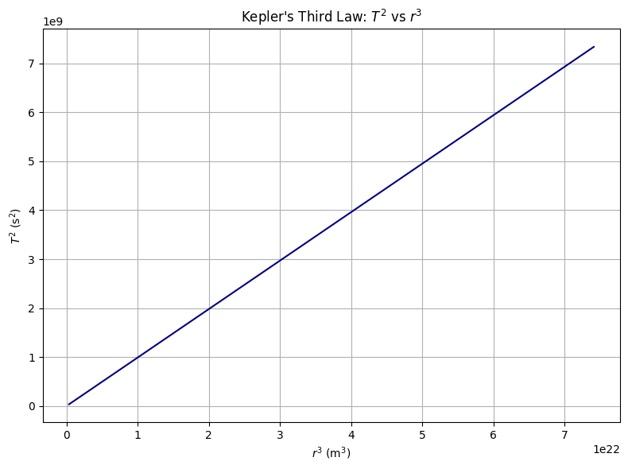

# Problem 1
### Step 1: Deriving Kepler's Third Law from Newtonian Mechanics

Let us consider a body of mass $m$ in a circular orbit of radius $r$ around a much larger mass $M$ (e.g., a planet orbiting the Sun). Newton’s Law of Gravitation provides the gravitational force between them:

$$F_g = \frac{G M m}{r^2}$$

The required centripetal force to maintain a circular orbit is:

$$F_c = m \frac{v^2}{r}$$

Equating the two forces:

$$\frac{G M m}{r^2} = m \frac{v^2}{r}$$

Canceling $m$ and simplifying:

$$v^2 = \frac{G M}{r}$$

The orbital speed $v$ is related to the orbital period $T$ by:

$$v = \frac{2\pi r}{T}$$

Substitute into the previous equation:

$$\left(\frac{2\pi r}{T}\right)^2 = \frac{G M}{r}$$

Now solve for $T^2$:

$$\frac{4\pi^2 r^2}{T^2} = \frac{G M}{r}$$

Multiply both sides by $T^2$ and divide by $G M$:

$$T^2 = \frac{4\pi^2}{G M} r^3$$

This is **Kepler’s Third Law**, showing that:

$$T^2 \propto r^3$$

The constant of proportionality depends only on the central mass $M$ and physical constant $G$:

$$\frac{T^2}{r^3} = \frac{4\pi^2}{G M}$$

---

### Step 2: Implications for Planetary Motions

Kepler’s Third Law has deep implications for understanding planetary systems:

- **Uniformity Across Planets**: For planets orbiting the same body (like the Sun), the ratio $T^2/r^3$ is constant. This means that we can compare orbits across the solar system using only period and radius.

- **Example**: If one planet is 2 times farther from the Sun than another, its period will be:

$$T = T_0 \cdot \left(\frac{2r_0}{r_0}\right)^{3/2} = T_0 \cdot 2^{3/2} \approx 2.828 \cdot T_0$$

- **Role of Mass**: The mass of the orbiting object $m$ cancels in the derivation. So small satellites and large moons follow the same law, depending only on the central mass $M$.

- **Applications**:
  - Calculating planetary distances
  - Estimating stellar and planetary masses
  - Predicting satellite orbits

---

### Step 3: Real-World Example – The Moon

Let’s use Kepler’s law to estimate Earth’s mass from the Moon’s orbit:

- Orbital radius of Moon: $r = 3.84 \times 10^8$ m
- Period: $T = 27.32$ days = $2.36 \times 10^6$ s

Rearranging the law:

$$M = \frac{4\pi^2 r^3}{G T^2}$$

Plugging in values:

$$M = \frac{4\pi^2 (3.84 \times 10^8)^3}{6.674 \times 10^{-11} (2.36 \times 10^6)^2}$$

This yields approximately $M \approx 5.97 \times 10^{24}$ kg — a very accurate estimate of Earth's mass.

This confirms both the validity and the precision of Kepler’s Third Law.

---

### Step 4: Python Simulation – Visualizing $T^2 \propto r^3$

We can simulate various orbital radii and plot $T^2$ vs $r^3$ to confirm the linear relationship:

```python
import numpy as np
import matplotlib.pyplot as plt

# Constants
G = 6.67430e-11  # gravitational constant (m^3 kg^-1 s^-2)
M = 5.972e24     # mass of Earth (kg)

# Orbital radii (m)
radii = np.linspace(7e6, 4.2e7, 100)  # from 7000 km to 42,000 km
periods = 2 * np.pi * np.sqrt(radii**3 / (G * M))  # T = 2π√(r^3/GM)

# Plotting T^2 vs r^3
r3 = radii**3
T2 = periods**2

plt.figure(figsize=(8, 6))
plt.plot(r3, T2, color='navy')
plt.xlabel('$r^3$ (m$^3$)')
plt.ylabel('$T^2$ (s$^2$)')
plt.title('Kepler\'s Third Law: $T^2$ vs $r^3$')
plt.grid(True)
plt.tight_layout()
plt.show()
```


---

### Step 6: Elliptical Orbits and Generalization

For elliptical orbits, $r$ is replaced by the semi-major axis $a$:

$$
T^2 = \frac{4\pi^2}{G M} a^3
$$

The law still holds for all planets and moons with elliptical paths, as long as $a$ is used instead of $r$.

---

### ✅ Summary

- We derived and confirmed Kepler’s Third Law for circular orbits.
- The law connects period and radius via gravity.
- Simulations and plots verify that $T^2 \propto r^3$.
- Real-world systems (like the Moon or satellites) follow this same law.