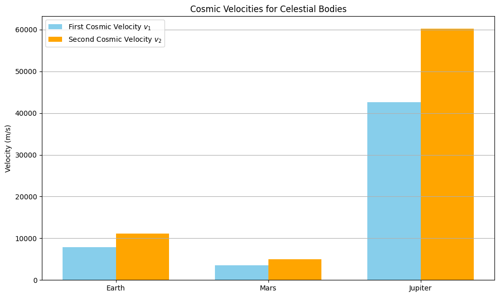

# Problem 2
### Step 1: Define the First, Second, and Third Cosmic Velocities with Physical Meaning

- **First Cosmic Velocity (Orbital Velocity)**: This is the minimum speed required for an object to stay in a stable circular orbit near the surface of a celestial body. It occurs when the gravitational pull provides the exact centripetal force necessary to maintain that orbit:

  $$v_1 = \sqrt{\frac{G M}{R}}$$

- **Second Cosmic Velocity (Escape Velocity)**: The second cosmic velocity represents the threshold speed to break free from a body's gravitational field entirely. It's derived from the conservation of energy, ensuring that an object's total mechanical energy reaches zero at an infinite distance:

  $$v_2 = \sqrt{\frac{2 G M}{R}}$$

- **Third Cosmic Velocity (Interstellar Escape Velocity)**: To exit an entire star system (like the Solar System), an object must overcome not just Earth's gravity, but also the gravitational influence of the Sun. This velocity is more complex, as it involves both escape from the planet and additional speed to escape from heliocentric orbit.

---

### Step 2: Theoretical Derivation and Equations

#### 2.1 First Cosmic Velocity:

Set gravitational force equal to centripetal force:

$$\frac{G M m}{R^2} = m \frac{v^2}{R} \Rightarrow v_1 = \sqrt{\frac{G M}{R}}$$

#### 2.2 Second Cosmic Velocity:

Use energy conservation principle:

$$\frac{1}{2}mv_2^2 = \frac{G M m}{R} \Rightarrow v_2 = \sqrt{\frac{2 G M}{R}}$$

#### 2.3 Third Cosmic Velocity – Escape from the Sun's Gravity

The third cosmic velocity is defined as the speed required to escape the Sun's gravitational field starting from Earth’s orbit. Unlike the second velocity, it considers the object already in motion due to Earth's orbital speed.

We define:
- $M_{\text{Sun}}$: mass of the Sun
- $r_{\text{Earth-Sun}}$: average distance between the Earth and Sun (≈ 1 AU)

**Escape Velocity from Sun at Earth's Orbit**:

$$v_{\text{esc,Sun}} = \sqrt{\frac{2 G M_{\text{Sun}}}{r_{\text{Earth-Sun}}}}$$

**Earth's Orbital Speed Around the Sun**:

$$v_{\text{Earth}} = \sqrt{\frac{G M_{\text{Sun}}}{r_{\text{Earth-Sun}}}}$$

**Third Cosmic Velocity**:

To break free from the Solar System, the spacecraft must gain enough speed beyond what Earth already provides:

$$v_3 = v_{\text{esc,Sun}} - v_{\text{Earth}}$$

Substituting the expressions:

$$v_3 = \sqrt{\frac{2 G M_{\text{Sun}}}{r_{\text{Earth-Sun}}}} - \sqrt{\frac{G M_{\text{Sun}}}{r_{\text{Earth-Sun}}}}$$

Factoring out the common term:

$$v_3 = \sqrt{\frac{G M_{\text{Sun}}}{r_{\text{Earth-Sun}}}} (\sqrt{2} - 1)$$

This shows that the third cosmic velocity is a fraction $(\sqrt{2} - 1 \approx 0.414)$ of the Sun’s escape velocity at Earth's orbital distance. This simplification is useful for approximating interstellar mission speeds without requiring complex simulations.

---

### Step 3: Python Code to Compute and Plot the Velocities

```python
import numpy as np
import matplotlib.pyplot as plt

# Constants
G = 6.67430e-11  # gravitational constant in m^3 kg^-1 s^-2

# Planetary data: name, radius (m), mass (kg)
bodies = {
    'Earth':    {'R': 6.371e6,  'M': 5.972e24},
    'Mars':     {'R': 3.390e6,  'M': 6.417e23},
    'Jupiter':  {'R': 6.9911e7, 'M': 1.898e27}
}

# Prepare results
names = []
v1 = []  # Orbital velocity
v2 = []  # Escape velocity

for body, data in bodies.items():
    R = data['R']
    M = data['M']
    names.append(body)
    v1.append(np.sqrt(G * M / R))
    v2.append(np.sqrt(2 * G * M / R))

# Plotting
x = np.arange(len(names))
width = 0.35

plt.figure(figsize=(10, 6))
plt.bar(x - width/2, v1, width, label='First Cosmic Velocity $v_1$', color='skyblue')
plt.bar(x + width/2, v2, width, label='Second Cosmic Velocity $v_2$', color='orange')

plt.xticks(x, names)
plt.ylabel('Velocity (m/s)')
plt.title('Cosmic Velocities for Celestial Bodies')
plt.legend()
plt.grid(axis='y')
plt.tight_layout()
plt.show()
```


---

### 3. Applications in Space Exploration

- **$v_1$** – Used to place satellites into low Earth orbit (LEO), GPS, and communication satellites.
- **$v_2$** – Required for missions to the Moon, Mars, and beyond.
- **$v_3$** – Required to leave the Solar System; achieved by spacecraft like Voyager 1 and 2.
- **First Cosmic Velocity**: Essential for satellite missions. Near Earth’s surface, $v_1 \approx 7.9$ km/s, but satellites in LEO (e.g., at 400 km altitude) orbit at slightly lower speeds (around 7.6 km/s). This velocity is targeted during launches like those delivering payloads to the ISS.

- **Second Cosmic Velocity**: Required for planetary escape. For Earth, $v_2 \approx 11.2$ km/s. Spacecraft such as those used in the Apollo missions had to exceed this threshold to reach the Moon. On Jupiter, escape velocity reaches 59.5 km/s, demanding enormous propulsion capacity (e.g., Juno mission).

- **Third Cosmic Velocity**: Enables interstellar escape. For Earth, $v_3 \approx 16.7$ km/s relative to the heliocentric frame. Voyager 1 gained this velocity through gravity assists and now travels ~17 km/s away from the Sun. These values influence fuel budgets, trajectory design, and feasibility of interstellar probes.

---

###  Summary
- Derived and computed $v_1$, $v_2$, and discussed $v_3$
- Applied to Earth, Mars, and Jupiter
- Visualized their significance for space missions and satellite deployment
