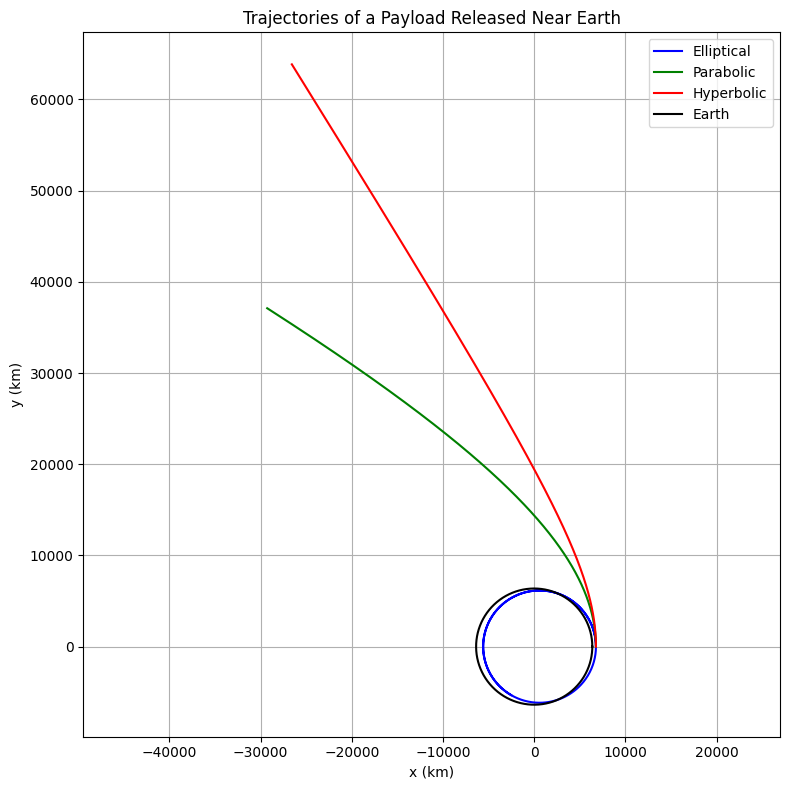

# Problem 3
### Step 1: Analyze Possible Trajectories

When a payload is released from a rocket near Earth, its future motion is determined by its speed, direction, and altitude. Depending on the specific energy $\epsilon$ of the system, the resulting path can be classified as:

- **Elliptical Trajectory** ($\epsilon < 0$): Bound orbit, repeating paths (circular or oval).
- **Parabolic Trajectory** ($\epsilon = 0$): The minimum speed needed to escape Earth — marginal case.
- **Hyperbolic Trajectory** ($\epsilon > 0$): Payload escapes Earth with excess kinetic energy.

The **specific mechanical energy** (energy per unit mass) is:

$$
\epsilon = \frac{v^2}{2} - \frac{GM}{r}
$$

Where:
- $v$ is the speed of the payload,
- $r$ is the radial distance from Earth’s center,
- $G$ is the gravitational constant,
- $M$ is the Earth's mass.

The expression comes from combining kinetic and gravitational potential energy:

- Kinetic energy per unit mass: $\frac{1}{2}v^2$
- Gravitational potential energy per unit mass: $-\frac{GM}{r}$

Hence:

$$
\epsilon = \frac{v^2}{2} - \frac{GM}{r}
$$

This confirms:
- $\epsilon < 0$: Elliptical orbit (bound)
- $\epsilon = 0$: Parabolic escape
- $\epsilon > 0$: Hyperbolic escape


### Formulas for Orbital Mechanics

**Escape Velocity**  
The speed required to escape a celestial body's gravity from a distance $r$:

$$v_{esc} = \sqrt{\frac{2GM}{r}}$$

---

**Circular Orbital Velocity**  
The speed needed to maintain a circular orbit at radius $r$:

$$v_{circ} = \sqrt{\frac{GM}{r}}$$

---

**Specific Mechanical Energy**  
The total energy per unit mass (kinetic + potential):

$$E = \frac{v^2}{2} - \frac{GM}{r}$$

- $E < 0$: Bound orbit (elliptical)  
- $E = 0$: Parabolic escape  
- $E > 0$: Hyperbolic escape

---

**Gravitational Force Between Two Masses**

$$F = \frac{G m_1 m_2}{r^2}$$

---

**Orbital Period (Kepler’s Third Law)**  
Applies to circular orbits:

$$T = 2\pi \sqrt{\frac{r^3}{GM}}$$
---

### Step 2: Equations of Motion in 2D

From Newton’s Law of Gravitation:

$$
\frac{d^2\vec{r}}{dt^2} = -\frac{GM}{r^3}\vec{r}
$$

Let $\vec{r} = (x, y)$, then:

$$
\frac{d^2x}{dt^2} = -\frac{GMx}{r^3}, \quad \frac{d^2y}{dt^2} = -\frac{GMy}{r^3}
$$

To solve numerically, define the state vector $[x, y, v_x, v_y]$ with:

$$
\frac{dx}{dt} = v_x, \quad \frac{dy}{dt} = v_y
$$
$$
\frac{dv_x}{dt} = -\frac{GMx}{r^3}, \quad \frac{dv_y}{dt} = -\frac{GMy}{r^3}
$$

---

### Step 3: Python Code for Trajectory Simulation

```python
import numpy as np
import matplotlib.pyplot as plt
from scipy.integrate import solve_ivp

# Constants
G = 6.67430e-11     # gravitational constant [m^3/kg/s^2]
M = 5.972e24         # mass of Earth [kg]
R = 6.371e6          # radius of Earth [m]
mu = G * M           # gravitational parameter [m^3/s^2]

# Define system of ODEs
def dynamics(t, state):
    x, y, vx, vy = state
    r = np.sqrt(x**2 + y**2)
    ax = -mu * x / r**3
    ay = -mu * y / r**3
    return [vx, vy, ax, ay]

# Initial position: 400 km above Earth's surface
x0 = R + 400000  # meters
y0 = 0

# Initial velocities for different trajectory types
v_values = [7300, 11180, 13000]  # m/s: elliptical, parabolic, hyperbolic
labels = ['Elliptical', 'Parabolic', 'Hyperbolic']
colors = ['blue', 'green', 'red']

plt.figure(figsize=(8, 8))

for v0, label, color in zip(v_values, labels, colors):
    vx0 = 0
    vy0 = v0
    state0 = [x0, y0, vx0, vy0]
    t_span = (0, 8000)
    t_eval = np.linspace(*t_span, 1000)

    sol = solve_ivp(dynamics, t_span, state0, t_eval=t_eval, rtol=1e-9)
    x, y = sol.y[0], sol.y[1]
    plt.plot(x/1000, y/1000, label=label, color=color)

# Earth
theta = np.linspace(0, 2*np.pi, 300)
plt.plot((R * np.cos(theta))/1000, (R * np.sin(theta))/1000, 'k', label='Earth')

plt.xlabel('x (km)')
plt.ylabel('y (km)')
plt.title('Trajectories of a Payload Released Near Earth')
plt.axis('equal')
plt.grid(True)
plt.legend()
plt.tight_layout()
plt.show()
```

---

### Step 4: Interpretation

- **Elliptical**: Captured orbit. Occurs when the initial speed is below escape velocity.
- **Parabolic**: Boundary case. Object escapes with zero final velocity.
- **Hyperbolic**: Object escapes with excess energy. Relevant for deep space missions.

These simulations reflect practical use cases in satellite deployment, space debris behavior, and interplanetary travel.

---

### Summary
- Introduced energy-based classification of orbits.
- Derived motion equations for gravitational acceleration in 2D.
- Created a realistic simulation tool in Python to explore various escape conditions.
- Discussed relevance to orbital insertion and mission planning.