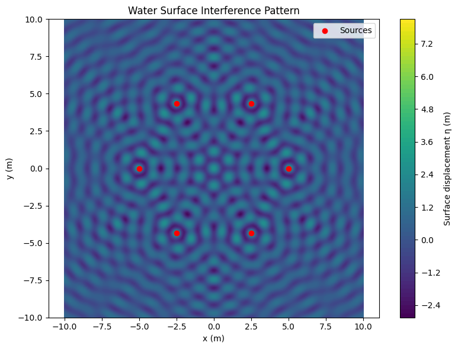

# Problem 1

## 1. Explanation of the Topic

Interference is a wave phenomenon that occurs when two or more wavefronts overlap in space. On a water surface, this is seen as regions where wave crests reinforce or cancel one another.

- **Constructive Interference**: when two waves meet in phase, they amplify.
- **Destructive Interference**: when two waves are out of phase, they cancel.

This principle is central in understanding wave behavior, not only in water but also in acoustics, optics, and even quantum mechanics.

---

## 2. Mathematical Background

### 2.1 Single Point Source Wave Equation

The wave from a single point source at $(x_0, y_0)$ is given by:

$$
\eta(x, y, t) = \frac{A}{\sqrt{r}} \cos(kr - \omega t + \phi)
$$

Where:
- $A$ is the amplitude,
- $r = \sqrt{(x - x_0)^2 + (y - y_0)^2}$ is the distance to the point,
- $k = \frac{2\pi}{\lambda}$ is the wave number,
- $\omega = 2\pi f$ is the angular frequency,
- $\phi$ is the phase offset.

### 2.2 Superposition of Multiple Waves

If there are $N$ identical, coherent sources, the total displacement at any point is:

$$
\eta_{sum}(x, y, t) = \sum_{i=1}^{N} \frac{A}{\sqrt{r_i}} \cos(k r_i - \omega t + \phi)
$$

Where $r_i$ is the distance from the $i$-th source.

---

## 3. Geometry of the Sources

Sources are placed at the vertices of a regular polygon (e.g., triangle, square, hexagon), distributed uniformly on a circle of radius $R$:

$$
x_i = R \cos\left(\frac{2\pi i}{N}\right), \quad y_i = R \sin\left(\frac{2\pi i}{N}\right)
$$

---

## 4. Python Code: Interference Simulation

````python
import numpy as np
import matplotlib.pyplot as plt

# Wave parameters
A = 1.0                     # Amplitude (m)
wavelength = 1.0            # Wavelength (m)
f = 1.0                     # Frequency (Hz)
k = 2 * np.pi / wavelength  # Wave number
w = 2 * np.pi * f           # Angular frequency
phi = 0                     # Initial phase

# Source configuration
N = 6                       # Number of sources (polygon sides)
R = 5.0                     # Radius of polygon
sources = [(R * np.cos(2 * np.pi * i / N), R * np.sin(2 * np.pi * i / N)) for i in range(N)]

# Grid
x = np.linspace(-10, 10, 500)
y = np.linspace(-10, 10, 500)
X, Y = np.meshgrid(x, y)
T = 0  # Time snapshot

# Function for one wave
def wave(x, y, x0, y0, A, k, w, phi, t):
    r = np.sqrt((x - x0)**2 + (y - y0)**2)
    r[r == 0] = 1e-6
    return A / np.sqrt(r) * np.cos(k * r - w * t + phi)

# Total wave
eta = np.zeros_like(X)
for x0, y0 in sources:
    eta += wave(X, Y, x0, y0, A, k, w, phi, T)

# Plot
plt.figure(figsize=(8, 6))
plt.contourf(X, Y, eta, levels=100, cmap='viridis')
plt.colorbar(label='Surface displacement η (m)')
plt.scatter(*zip(*sources), color='red', label='Sources')
plt.title('Water Surface Interference Pattern')
plt.xlabel('x (m)')
plt.ylabel('y (m)')
plt.axis('equal')
plt.legend()
plt.tight_layout()
plt.show()
````


---

## 5. Analyze the Results

- **Patterns**: The plot shows bright and dark zones corresponding to constructive and destructive interference, respectively. The center often shows intense oscillation due to symmetrical source alignment.
- **Symmetry**: Because the sources are placed symmetrically (e.g., equilateral triangle, square), the interference patterns exhibit symmetrical structures.
- **Parameter Dependence**:
  - Reducing the wavelength $\lambda$ increases the number of fringes (denser pattern).
  - Changing the phase $\phi$ of one source distorts symmetry and shifts interference nodes.
  - Increasing the amplitude $A$ intensifies the wave height without affecting the pattern geometry.

---

## 6. Conclusions

This simulation of wave interference on a water surface highlights the rich dynamics of wave superposition. By summing the displacements from multiple coherent sources, we observe:

- **Constructive interference** forming crests where waves align in phase.
- **Destructive interference** resulting in cancellation zones where waves are out of phase.
- **Real-world relevance**: These insights apply to sound waves, light diffraction, radar systems, and ocean engineering.

Using simple principles of circular wave propagation and numerical tools like Python, students can intuitively understand:
- how phase, amplitude, and geometry control wave outcomes,
- and how symmetry and coherence lead to organized patterns.

This makes the task valuable both for developing computational skills and for reinforcing theoretical physics concepts.

---

## 7. Explanation of the Code

- **Parameters**: The values of amplitude $A$, wavelength $\lambda$, frequency $f$, wave number $k = \frac{2\pi}{\lambda}$, and angular frequency $\omega = 2\pi f$ are defined at the beginning.
- **Source Placement**: Sources are placed symmetrically at the vertices of a regular polygon. Their coordinates are computed using trigonometry on a circle of radius $R$.
- **Grid Construction**: A meshgrid of $(x, y)$ coordinates is created using `np.meshgrid()` to simulate the water surface over a region.
- **Wave Function**: A function calculates wave amplitude at each point from a single source based on distance $r$ and applies the formula:

  $$
  \eta(x, y, t) = \frac{A}{\sqrt{r}} \cos(kr - \omega t + \phi)
  $$

- **Superposition**: The contributions of all sources are summed point-wise using a loop.
- **Visualization**: A 2D contour plot is generated with `plt.contourf()`, which maps wave height to color gradients. Red and blue zones highlight wave peaks and troughs, while white or neutral zones indicate destructive cancellation.

---

## 8. Explanation of the Solution

- **Step 1**: We chose a regular polygon (e.g., equilateral triangle) to place wave sources in a symmetric layout, which helps visualize balanced interference.
- **Step 2**: We wrote the wave equation for each point source and applied the principle of superposition to calculate net displacement at each grid point.
- **Step 3**: We explored the resulting interference pattern, studying how parameters like $\lambda$, $\phi$, and number of sources affect the structure.


