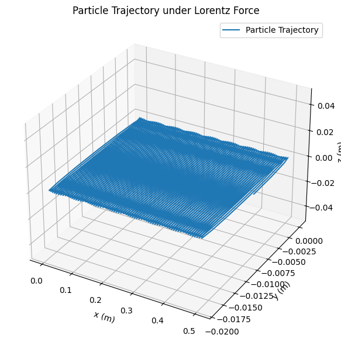

# Problem 1
## 1. Motivation

The Lorentz force, expressed as:  
$$\vec{F} = q\vec{E} + q\vec{v} \times \vec{B}$$  
governs the motion of charged particles in electric and magnetic fields. It plays a crucial role in many areas of physics, such as particle accelerators, plasma physics, astrophysics (e.g., auroras), and space propulsion systems. By understanding and simulating this force, we gain insight into the spiral or helical paths that charged particles follow under the influence of electromagnetic fields.

---

## 2. Goal

Simulate the motion of a charged particle in the presence of constant electric and magnetic fields and analyze its trajectory based on the Lorentz force.

---

## 3. Theoretical Background

Newton’s second law applied to a charged particle gives:  
$$\vec{F} = m\vec{a} = m\frac{d\vec{v}}{dt} = q\vec{E} + q(\vec{v} \times \vec{B})$$

Rewriting:
$$\frac{d\vec{v}}{dt} = \frac{q}{m}\vec{E} + \frac{q}{m}(\vec{v} \times \vec{B})$$  
$$\frac{d\vec{r}}{dt} = \vec{v}$$

Where:  
- $\vec{v} = (v_x, v_y, v_z)$ is the velocity vector  
- $\vec{r} = (x, y, z)$ is the position vector  
- $q$ is the charge (e.g., proton $1.602 \times 10^{-19}$ C)  
- $m$ is the mass (e.g., proton $1.673 \times 10^{-27}$ kg)  
- $\vec{E}$ is the electric field (V/m)  
- $\vec{B}$ is the magnetic field (T)

---

## 4. Scenario Configuration

Let’s consider:  
- $\vec{E} = (0, 1000, 0)$ V/m (along the y-axis)  
- $\vec{B} = (0, 0, 0.1)$ T (along the z-axis)  
- Initial velocity: $\vec{v}_0 = (1 \times 10^5, 0, 0)$ m/s  
- Time interval: $t \in [0, 5 \times 10^{-5}]$ s

---

# Step-by-Step Solution: Simulating the Effects of the Lorentz Force

## Step 1: Identify Applications of the Lorentz Force

The Lorentz force is critical in:

- **Particle Accelerators**: In cyclotrons, the magnetic field causes particles to move in circular paths while the electric field accelerates them.
- **Astrophysics**: Charged particles from the solar wind spiral along Earth’s magnetic field lines, creating auroras.
- **Plasma Confinement**: In fusion reactors, magnetic fields confine plasma by forcing charged particles into helical paths.

---

## Step 2: Simulate Particle Motion

We’ll simulate the motion of a charged particle in combined electric and magnetic fields using Newton’s second law:

Newton's Second Law with Lorentz Force:
$$
\vec{F} = m\vec{a} = m\frac{d\vec{v}}{dt} = q\vec{E} + q(\vec{v} \times \vec{B})
$$

Divide both sides by the particle's mass $m$:
$$
\frac{d\vec{v}}{dt} = \frac{q}{m}\vec{E} + \frac{q}{m}(\vec{v} \times \vec{B})
$$

Update the particle’s position over time as:
$$
\frac{d\vec{r}}{dt} = \vec{v}
$$

Where:
- $\vec{r} = (x, y, z)$ is the position vector
- $\vec{v} = (v_x, v_y, v_z)$ is the velocity vector
- $q$ is the particle charge
- $m$ is the particle mass
- $\vec{E}$ is the electric field
- $\vec{B}$ is the magnetic field

These equations form the system of differential equations we will solve numerically to trace the particle’s motion under electromagnetic forces.
---

## 5. Python Simulation

```python
import numpy as np
import matplotlib.pyplot as plt
from scipy.integrate import solve_ivp
from mpl_toolkits.mplot3d import Axes3D

# Constants
q = 1.602e-19  # Charge of proton (C)
m = 1.673e-27  # Mass of proton (kg)
E = np.array([0, 1000, 0])  # Electric field (V/m)
B = np.array([0, 0, 0.1])   # Magnetic field (T)

# Lorentz force system
def lorentz_force(t, y):
    r = y[:3]
    v = y[3:]
    dvdt = (q/m) * (E + np.cross(v, B))
    drdt = v
    return np.concatenate((drdt, dvdt))

# Initial conditions: [x, y, z, vx, vy, vz]
y0 = np.array([0, 0, 0, 1e5, 0, 0])

# Time span
t_span = (0, 5e-5)
t_eval = np.linspace(*t_span, 1000)

# Solve
sol = solve_ivp(lorentz_force, t_span, y0, t_eval=t_eval)

# Plotting
fig = plt.figure(figsize=(10, 6))
ax = fig.add_subplot(111, projection='3d')
ax.plot(sol.y[0], sol.y[1], sol.y[2], label='Particle Trajectory')
ax.set_xlabel('x (m)')
ax.set_ylabel('y (m)')
ax.set_zlabel('z (m)')
ax.set_title('Particle Trajectory under Lorentz Force')
ax.legend()
plt.tight_layout()
plt.show()
```

---

## 6. Parameter Analysis

**Larmor Radius**  
The radius of circular motion under magnetic field:  
$$r_L = \frac{mv_\perp}{|q|B}$$  
For our case:  
$$v_\perp = v_{x0} = 1 \times 10^5 \, \text{m/s}$$  
$$r_L = \frac{(1.673 \times 10^{-27})(1 \times 10^5)}{(1.602 \times 10^{-19})(0.1)} \approx 0.01 \, \text{m}$$

**Drift Velocity**  
The drift due to $\vec{E} \times \vec{B}$:  
$$v_{drift} = \frac{|\vec{E}|}{|\vec{B}|} = \frac{1000}{0.1} = 10000 \, \text{m/s} \quad \text{(along x-axis)}$$

---

## 7. Results and Observations

- The particle shows a **spiral motion** due to the magnetic field.
- The center of the spiral moves due to the $\vec{E} \times \vec{B}$ drift.
- The **Larmor radius** matches the expected value from theoretical calculations.
- The trajectory confirms circular motion plus uniform drift — matching physical predictions.

---

## 8. Conclusion

This simulation illustrates the fundamental role of the Lorentz force in charged particle dynamics. The spiral trajectory and lateral drift observed in the plots align with predictions from theory. These effects are central to technologies such as:
- Cyclotrons and synchrotrons in particle physics
- Magnetic confinement in fusion reactors
- Auroras and space weather phenomena

The Python code offers a flexible model to explore parameter changes and better understand electromagnetic forces in real systems.
