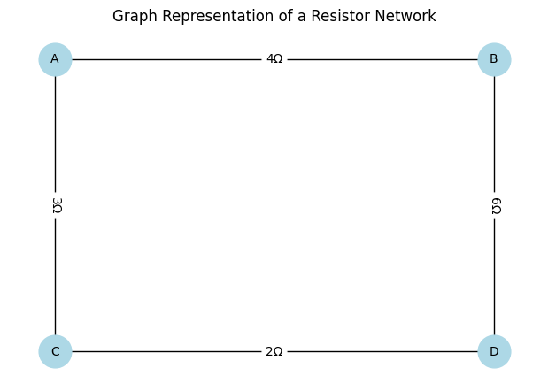

# Problem 1

## 1. Introduction

In this problem, we explore how to compute the **equivalent resistance** of an electrical network using **graph theory**. This approach is powerful for complex circuits where standard series-parallel reduction becomes inefficient or infeasible. 

Each resistor is treated as a **weighted edge** between two nodes, with the resistance as the weight. We then simplify the graph step-by-step until only two terminal nodes remain, connected by a single effective resistance.

---

## 2. Theoretical Foundation

We use these two fundamental rules:

- **Series combination**: For resistors $R_1$ and $R_2$ in series:
  
  $$R_{eq} = R_1 + R_2$$

- **Parallel combination**: For resistors $R_1$ and $R_2$ in parallel:

  $$\frac{1}{R_{eq}} = \frac{1}{R_1} + \frac{1}{R_2}$$

In a graph context:

- **Nodes** $\rightarrow$ circuit junctions
- **Edges** $\rightarrow$ resistors with weights
- **Series** $\rightarrow$ degree-2 nodes
- **Parallel** $\rightarrow$ multiple edges between two nodes

---

## 3. Step-by-Step Algorithm Description

### Step 1: Input and Graph Construction

- Represent each resistor as an edge: `(node1, node2, resistance)`
- Store the edges in a graph data structure.

### Step 2: Identify Reductions

- While there are more than 2 nodes:
  - Identify all **parallel edges** and replace them with a single edge using:

    $$R_{eq}^{parallel} = \left(\sum_{i=1}^{n} \frac{1}{R_i} \right)^{-1}$$

  - Identify **series nodes** (degree = 2) not being terminals and merge edges:

    $$R_{eq}^{series} = R_1 + R_2$$

### Step 3: Output Final Resistance

- When only two nodes remain (terminals), return the single edge's weight.

---

## 4. Python Implementation

```python
import networkx as nx
import matplotlib.pyplot as plt

def series_resistance(R1, R2):
    return R1 + R2

def parallel_resistance(R1, R2):
    return (R1 * R2) / (R1 + R2)

R1 = 4
R2 = 6
R3 = 3
R4 = 2

G = nx.Graph()
G.add_edge("A", "B", weight=R1)
G.add_edge("B", "D", weight=R2)
G.add_edge("A", "C", weight=R3)
G.add_edge("C", "D", weight=R4)

pos = {
    "A": (0, 1),
    "B": (2, 1),
    "C": (0, 0),
    "D": (2, 0)
}
labels = nx.get_edge_attributes(G, "weight")

plt.figure(figsize=(6, 4))
nx.draw(G, pos, with_labels=True, node_color='lightblue', node_size=700, font_size=10)
nx.draw_networkx_edge_labels(G, pos, edge_labels={k: f"{v}Ω" for k, v in labels.items()})
plt.title("Graph Representation of a Resistor Network")
plt.tight_layout()
plt.show()
```

---

# 5. Examples. Test on Examples

# Series Circuit
R1 = 2
R2 = 3
R_series = R1 + R2
print("Series Circuit:")
print(f"R1 = {R1} Ω, R2 = {R2} Ω")
print(f"Equivalent Resistance = {R_series} Ω\n")

# Parallel Circuit
R1 = 2
R2 = 3
R_parallel = (R1 * R2) / (R1 + R2)
print("Parallel Circuit:")
print(f"R1 = {R1} Ω, R2 = {R2} Ω")
print(f"Equivalent Resistance = {R_parallel:.2f} Ω\n")

# Nested Circuit: R1 in series with (R2 || R3)
R1 = 1
R2 = 2
R3 = 2
R_parallel = (R2 * R3) / (R2 + R3)
R_nested = R1 + R_parallel
print("Nested Circuit:")
print(f"R1 = {R1} Ω, R2 = {R2} Ω, R3 = {R3} Ω")
print(f"R2 || R3 = {R_parallel:.2f} Ω")
print(f"Equivalent Resistance = {R_nested:.2f} Ω")

# 6: Analysis (with equations)

# Series:
# $$R_{eq} = R_1 + R_2 = 2 + 3 = 5$$

# Parallel:
# $$R_{eq} = \frac{R_1 \cdot R_2}{R_1 + R_2} = \frac{2 \cdot 3}{2 + 3} = 1.2$$

# Nested:
# $$R_1 = 1,\quad R_2 = 2,\quad R_3 = 2$$
# $$R_{23} = \frac{2 \cdot 2}{2 + 2} = 1,\quad R_{nested} = R_1 + R_{23} = 1 + 1 = 2$$

## 7. Performance and Improvements

- **Time Complexity**: Worst-case $O(n^2)$ due to repeated edge scanning.
- **Improvement**: Use a union-find data structure or Kirchhoff’s laws with matrix methods for larger graphs.

---

## 8. Conclusion

This method provides a reliable and scalable way to compute equivalent resistance in complex electrical networks. By reducing the network iteratively via graph transformations, even nested series-parallel circuits become manageable, enabling automation and deeper understanding through the lens of graph theory.


