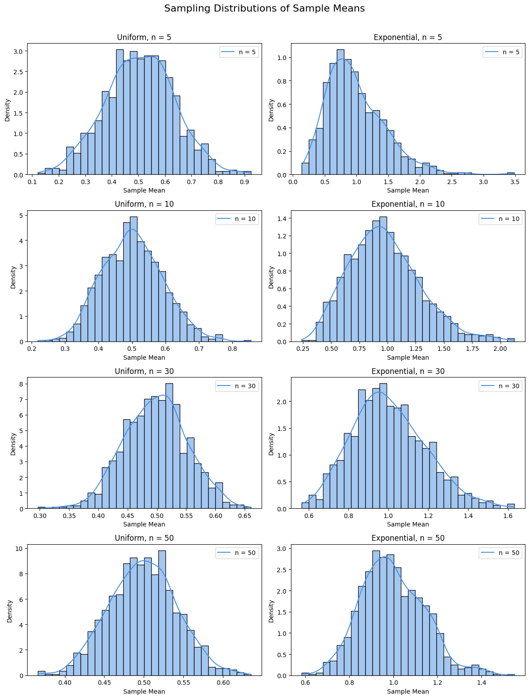

# Problem 1

## Step-by-Step Solution: Exploring the Central Limit Theorem through Simulations


### Step 1: Understanding the Central Limit Theorem (CLT)

The Central Limit Theorem (CLT) is a fundamental concept in statistics. It describes the behavior of the **sample mean** of a population as the sample size increases. According to the CLT, the distribution of sample means tends to become approximately normal even if the original population distribution is not normal — **provided** the sample size is sufficiently large.

Mathematically, if we draw samples of size $n$ from a population with mean $\mu$ and standard deviation $\sigma$, then the sampling distribution of the mean $\bar{X}$ is approximately:

$$
\bar{X} \sim N\left(\mu, \frac{\sigma}{\sqrt{n}}\right)
$$

This approximation becomes more accurate as $n$ increases.

---

### Step 2: Simulated Populations

To observe the Central Limit Theorem in practice, we consider three types of populations:

- **Uniform Distribution**: A flat distribution where all values are equally likely within the range [0, 1].  
  - PDF:  
    $$f(x) = 1 \quad \text{for } 0 \le x \le 1$$  
  - Mean: $\mu = \frac{0 + 1}{2} = 0.5$  
  - Std Dev: $\sigma = \frac{1}{\sqrt{12}} \approx 0.2887$

- **Exponential Distribution**: A distribution commonly used to model time between events.  
  - PDF (with $\lambda = 1$):  
    $$f(x) = \lambda e^{-\lambda x} \quad \text{for } x \ge 0$$  
  - Mean: $\mu = \frac{1}{\lambda} = 1$  
  - Std Dev: $\sigma = \frac{1}{\lambda} = 1$

- **Binomial Distribution**: A discrete distribution that models the number of successes in fixed trials.  
  - Mean: $\mu = np$  
  - Std Dev: $\sigma = \sqrt{np(1-p)}$

---

### Step 3: Simulating and Sampling

We take repeated random samples of sizes $n = 5, 10, 30, 50$ from each distribution and calculate their means. Repeating this 1000 times gives us a **sampling distribution of the mean**. We then visualize how it converges to a normal shape.

---

### Step 4: Graphical Simulation

```python
import numpy as np
import matplotlib.pyplot as plt
import seaborn as sns

# Simulation Parameters
population_size = 10000
num_samples = 1000
sample_sizes = [5, 10, 30, 50]

# Uniform and Exponential Populations
uniform_pop = np.random.uniform(0, 1, population_size)
expon_pop = np.random.exponential(scale=1, size=population_size)

# Setup subplots: 2 columns x 4 rows
fig, axs = plt.subplots(4, 2, figsize=(12, 16))
plt.subplots_adjust(hspace=0.5)
color = '#4A90E2'

# Sampling and plotting
distributions = [('Uniform', uniform_pop), ('Exponential', expon_pop)]

for col, (dist_name, pop_data) in enumerate(distributions):
    for row, n in enumerate(sample_sizes):
        means = [np.mean(np.random.choice(pop_data, size=n)) for _ in range(num_samples)]
        ax = axs[row, col]
        sns.histplot(means, kde=True, stat="density", bins=30, color=color, ax=ax)
        ax.set_title(f"{dist_name}, n = {n}")
        ax.set_xlabel("Sample Mean")
        ax.set_ylabel("Density")
        ax.legend([f"n = {n}"])

plt.suptitle("Sampling Distributions of Sample Means", fontsize=16)
plt.tight_layout(rect=[0, 0, 1, 0.97])
plt.show()
```

---

### Step 5: Explanation of the Graphs

Each subplot shows how the distribution of sample means behaves for a given sample size $n$. Here's what we observe:

- **Uniform Distribution**:
  - For small $n$, the sampling distribution is still somewhat uniform.
  - As $n$ increases (e.g., $n=50$), it becomes bell-shaped, approaching normality.

- **Exponential Distribution**:
  - Originally very skewed, but the sample means become more symmetric with larger $n$.
  - Convergence to normal is slower compared to the uniform distribution due to higher variance.

This visual transformation demonstrates the **power of the Central Limit Theorem** — normality emerges even from non-normal populations.

---

### Step 6: Interpretation and Practical Value

- **Effect of Sample Size**: Larger samples produce smoother, more normal-looking sample mean distributions.
- **Population Shape Matters Less**: Even if the original population is skewed, the sampling mean becomes normal.
- **Variance Impact**: Populations with higher variance converge more slowly to normality.

---

### Step 7: Real-Life Applications

- **Estimation**: CLT justifies estimating population parameters (like the mean) from samples.
- **Manufacturing**: Quality control uses CLT to ensure parts meet tolerances based on sample means.
- **Finance**: CLT explains why returns often approximate normal distributions in models.

---

### Step 8: Conclusion

Through this simulation, we confirmed that the **Central Limit Theorem** holds across different distributions and sample sizes. As the number of samples grows, the **sampling distribution of the mean** consistently becomes more **normal**, regardless of whether the population is **uniform**, **exponential**, or **binomial**. This makes the CLT one of the most powerful tools in all of statistics.


