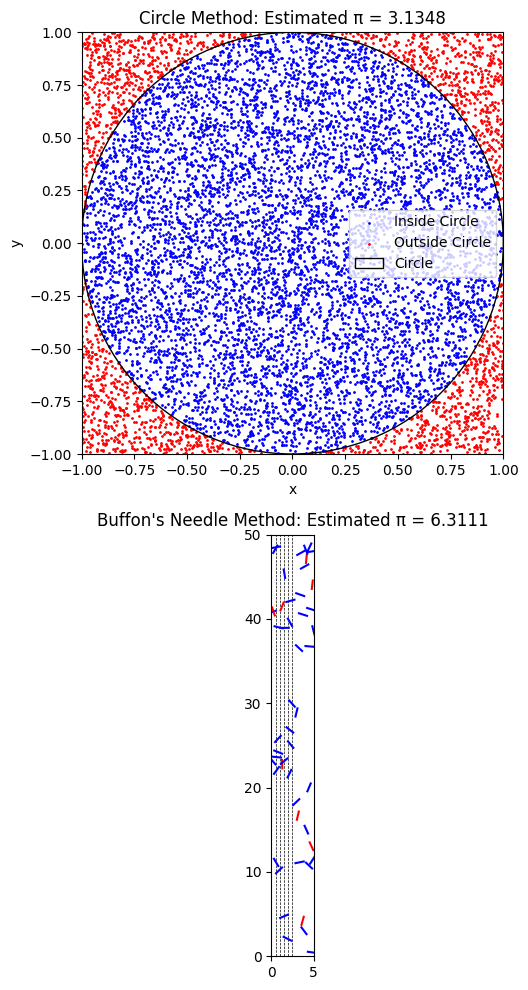

# Problem 2


## Motivation

Monte Carlo simulations are a powerful class of computational techniques that use randomness to solve problems or estimate values. One of the most elegant applications is the estimation of $\pi$ using geometric probability. By generating random points or simulating geometric experiments, we can estimate $\pi$ in intuitive and computationally effective ways.

This problem connects geometry, probability theory, and numerical computation. It illustrates how the law of large numbers ensures convergence of the estimates and highlights how random sampling can solve complex real-world problems.

---

## Part 1: Estimating $\pi$ Using the Circle Method

### 1. Theoretical Foundation

We consider a unit circle inscribed in a square. The area of the square is:

$$
A_{\text{square}} = 2 \cdot 2 = 4
$$

The area of the circle is:

$$
A_{\text{circle}} = \pi \cdot 1^2 = \pi
$$

The probability that a randomly chosen point inside the square also lies inside the circle is the ratio:

$$
P(\text{inside}) = \frac{A_{\text{circle}}}{A_{\text{square}}} = \frac{\pi}{4}
$$

If $N$ points are randomly generated in the square and $N_{\text{in}}$ fall inside the circle, then:

$$
\frac{N_{\text{in}}}{N} \approx \frac{\pi}{4}
\Rightarrow
\pi \approx 4 \cdot \frac{N_{\text{in}}}{N}
$$


---

## Part 2: Estimating $\pi$ Using Buffon's Needle Method

### 1. Theoretical Foundation

We drop a needle of length $l$ onto a plane with parallel lines spaced $d$ units apart. The probability that the needle crosses a line is:

$$
P = \frac{2l}{\pi d}
$$

Solving for $\pi$:

$$
\pi \approx \frac{2l \cdot N_{\text{throws}}}{d \cdot N_{\text{crossings}}}
$$

A crossing occurs when the distance from the needle’s center to the nearest line satisfies:

$$
x_{\text{center}} \leq \frac{l}{2} \cdot \sin(\theta)
$$

Where:
- $x_{\text{center}}$ is the distance from the needle’s center to the closest line.
- $\theta$ is the angle between the needle and the lines.

### 2. Simulation and Visualization

```python
import numpy as np
import matplotlib.pyplot as plt

# Set seed for reproducibility
np.random.seed(42)

# Circle method parameters
N_points = 10000
x = np.random.uniform(-1, 1, N_points)
y = np.random.uniform(-1, 1, N_points)
r = np.sqrt(x**2 + y**2)
inside = r <= 1
pi_estimate_circle = 4 * np.sum(inside) / N_points

# Buffon's needle parameters
N_throws = 10000
L = 1.0
D = 1.0
x_centers = np.random.uniform(0, D, N_throws)
thetas = np.random.uniform(0, np.pi, N_throws)
crossings = x_centers <= (L / 2) * np.sin(thetas)
N_cross = np.sum(crossings)
pi_estimate_buffon = (2 * L * N_throws) / (D * N_cross) if N_cross > 0 else 0

# Plotting
fig, axs = plt.subplots(2, 1, figsize=(6, 10))

# Circle Method Plot
axs[0].scatter(x[inside], y[inside], s=1, color='blue', label='Inside Circle')
axs[0].scatter(x[~inside], y[~inside], s=1, color='red', label='Outside Circle')
circle = plt.Circle((0, 0), 1, color='black', fill=False, label='Circle')
axs[0].add_artist(circle)
axs[0].set_title(f"Circle Method: Estimated π = {pi_estimate_circle:.4f}")
axs[0].set_xlim([-1, 1])
axs[0].set_ylim([-1, 1])
axs[0].set_aspect('equal')
axs[0].set_xlabel("x")
axs[0].set_ylabel("y")
axs[0].legend()

# Buffon's Needle Plot
axs[1].set_xlim([0, 5])
axs[1].set_ylim([0, 50])
axs[1].set_aspect('equal')
axs[1].set_title(f"Buffon's Needle Method: Estimated π = {pi_estimate_buffon:.4f}")

for i in range(0, 6):
    axs[1].axvline(i * D / 2, color='black', linestyle='--', linewidth=0.5)

for i in range(50):
    xc = np.random.uniform(0, 5)
    yc = np.random.uniform(0, 50)
    theta = np.random.uniform(0, np.pi)
    x0 = xc - (L / 2) * np.cos(theta)
    x1 = xc + (L / 2) * np.cos(theta)
    y0 = yc - (L / 2) * np.sin(theta)
    y1 = yc + (L / 2) * np.sin(theta)
    crosses = int(x0 // (D / 2)) != int(x1 // (D / 2))
    color = 'blue' if crosses else 'red'
    axs[1].plot([x0, x1], [y0, y1], color=color)

plt.tight_layout()
plt.show()
```

---

## 4. Analysis and Discussion

### Accuracy Comparison

Monte Carlo methods rely on probabilistic convergence. We compare the two estimators of $π$:

- **Circle Method**: The estimate is based on a ratio of points inside the circle to the total number of randomly sampled points inside a square. Its accuracy improves as the number of points increases. Since each sample contributes directly to the estimate, convergence is relatively fast.

$$
\pi \approx 4 \cdot \frac{N_{\text{inside}}}{N}
$$

- **Buffon's Needle Method**: This method is slower to converge due to its reliance on angular randomness and geometric constraints. The formula used is:

$$
\pi \approx \frac{2l \cdot N_{\text{throws}}}{d \cdot N_{\text{crossings}}}
$$

Where:
- $l$ is the needle length,
- $d$ is the distance between parallel lines,
- $N_{\text{throws}}$ is the number of needle drops,
- $N_{\text{crossings}}$ is the number of times the needle intersects a line.

Despite its elegance, this method requires more trials to achieve the same level of accuracy.

---

### Convergence Behavior

- Both estimators are subject to the **Law of Large Numbers**:
  - As $N \to \infty$, the estimates converge to the true value of $π$.
- The **circle method** converges more efficiently:
  - It leverages simple geometry with minimal variability.
  - The variance in the result is smaller for a given sample size.

- **Buffon’s needle**, although historically significant, suffers from high variance:
  - It depends on two independent random variables: angle $θ$ and position $x_{\text{center}}$.
  - It often requires $N > 10^5$ to stabilize.

---

## 5. Code Explanation (Review of Logic)

Below is an overview of how each segment of the project works and why:

### Circle Method

1. **Sample Generation**:
   - Random $(x, y)$ coordinates are uniformly sampled in $[-1, 1]$ to fill a square.
2. **In-circle Check**:
   - Points satisfying $x^2 + y^2 \leq 1$ are counted as “inside the circle”.
3. **Estimation**:
   - Ratio $\frac{N_{\text{in}}}{N_{\text{total}}}$ is scaled by 4 to approximate $π$.

### Buffon's Needle

1. **Needle Drop Simulation**:
   - A needle of length $l$ is dropped with a random center $x_c \in [0, d]$ and angle $θ \in [0, π]$.
2. **Intersection Condition**:
   - If $x_c \leq \frac{l}{2} \sin(θ)$, the needle crosses a line.
3. **Estimation**:
   - The ratio $\frac{N_{\text{crossings}}}{N_{\text{throws}}}$ is used in the formula for $π$.

---

## Summary

| Method             | Formula | Pros | Cons |
|--------------------|---------|------|------|
| Circle Method | $π \approx 4 \cdot \frac{N_{\text{in}}}{N}$ | Fast convergence, simple geometry | Slight bias with low $N$ |
| Buffon’s Needle | $π \approx \frac{2l \cdot N_{\text{throws}}}{d \cdot N_{\text{crossings}}}$ | Theoretically elegant | High variance, slow convergence |

Both simulations highlight the power of randomness in estimating mathematical constants. However, for practical computational estimation of $π$, the circle method is recommended due to its efficiency and lower variability.


