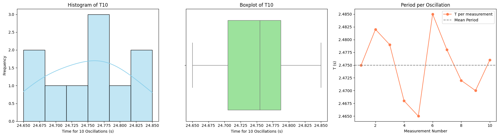

# Problem 1

## Motivation

The acceleration due to gravity, denoted as $g$, is a fundamental physical constant that influences the motion of objects under the Earth's gravitational field. Precise measurement of $g$ is essential for many branches of physics and engineering, including mechanics, structural analysis, and gravitational experiments.

One of the most classical and pedagogical methods for estimating $g$ involves observing the oscillations of a simple pendulum. The period of these oscillations depends on the gravitational acceleration and the length of the pendulum. This experiment allows us to explore physical relationships and uncertainty analysis using basic tools and measurements.

---

## Part 1: Theoretical Foundation

The time period $T$ of a simple pendulum (when displaced at a small angle) is given by the formula:

$$
T = 2\pi \sqrt{\frac{L}{g}}
$$

Solving for $g$:

$$
g = \frac{4\pi^2 L}{T^2}
$$

Where:
- $L$ is the length of the pendulum (from pivot to the center of mass of the bob),
- $T$ is the period of one complete oscillation.

If we measure the time for $10$ oscillations as $T_{10}$ and take the average over multiple trials, the period for one oscillation becomes:

$$
T = \frac{\overline{T_{10}}}{10}
$$

The uncertainty in this average time is given by:

$$
\Delta T_{10} = \frac{\sigma_T}{\sqrt{n}}
$$

And the uncertainty in a single oscillation:

$$
\Delta T = \frac{\Delta T_{10}}{10}
$$

---

## Part 2: Uncertainty Propagation

Once we calculate $g$ from the measured $T$ and $L$, we compute the uncertainty $\Delta g$ using the propagation of uncertainties formula:

$$
\Delta g = g \cdot \sqrt{\left(\frac{\Delta L}{L}\right)^2 + \left(2 \cdot \frac{\Delta T}{T}\right)^2}
$$

This takes into account both the uncertainty in the length measurement and the timing measurement.

---

## Procedure

### 1. Materials
- A string (1–1.5 m)
- A small dense object (weight, keychain, etc.)
- Stopwatch or smartphone
- Ruler or measuring tape

### 2. Setup
- Attach the weight securely to one end of the string.
- Measure the pendulum length $L$ with a ruler or tape measure.
- Estimate the uncertainty as half the smallest division:

$$
\Delta L = \frac{\text{Ruler Resolution}}{2}
$$

### 3. Data Collection
- Pull the pendulum back slightly ($<15^\circ$) and release.
- Time 10 full oscillations and repeat the measurement 10 times.
- Record all 10 values of $T_{10}$.

---

## Calculations

### 1. Mean Time and Standard Deviation

Compute the average of $T_{10}$:

$$
\overline{T_{10}} = \frac{1}{n} \sum_{i=1}^{n} T_{10,i}
$$

Compute standard deviation:

$$
\sigma_T = \sqrt{\frac{1}{n - 1} \sum_{i=1}^{n} (T_{10,i} - \overline{T_{10}})^2}
$$

Determine uncertainty in the mean:

$$
\Delta T_{10} = \frac{\sigma_T}{\sqrt{n}}, \quad \Delta T = \frac{\Delta T_{10}}{10}
$$

### 2. Period and $g$

$$
T = \frac{\overline{T_{10}}}{10}, \quad g = \frac{4\pi^2 L}{T^2}
$$

### 3. Uncertainty in $g$

$$
\Delta g = g \cdot \sqrt{\left(\frac{\Delta L}{L}\right)^2 + \left(2 \cdot \frac{\Delta T}{T}\right)^2}
$$

---

## Analysis

1. Compare the measured value of $g$ to the accepted standard value:

$$
g_{\text{standard}} = 9.81\ \text{m/s}^2
$$

Compute percent error:

$$
\text{Percent Error} = \left| \frac{g_{\text{measured}} - g_{\text{standard}}}{g_{\text{standard}}} \right| \cdot 100\%
$$

2. Discuss the sources of uncertainty:

- **Length measurement ($\Delta L$):** Affects the calculated value of $g$ directly. A small error in $L$ leads to a linear error in $g$.
- **Timing variability ($\Delta T$):** Human reaction time introduces fluctuation in results. Multiple trials help reduce this uncertainty.
- **Experimental conditions:** Small angle assumption must hold; air resistance and mass of the string should be negligible.


# Analysis and Visualization: Pendulum Method for Measuring 

## 1. Experimental Context

We measured the time for 10 oscillations of a pendulum in 10 trials, then computed the period for one oscillation. The goal is to assess the consistency of the measurements, visualize the spread, and evaluate the uncertainty before calculating gravitational acceleration $g$.

---

## 2. Explanation of Graphs

- **Histogram of $T_{10}$**: Shows the frequency distribution of total time for 10 oscillations.
- **Boxplot of $T_{10}$**: Indicates the spread, median, and possible outliers.
- **Line Plot of Period per Oscillation**: Depicts the variation in calculated period $T$ from each measurement, alongside the mean.

These plots help assess the **stability of measurements**, **presence of systematic deviations**, and **random uncertainty**.

---

## 3. Python Code to Generate Graphs

```python
import numpy as np
import matplotlib.pyplot as plt
import seaborn as sns

# Measurements: Time for 10 oscillations
T10 = np.array([24.75, 24.82, 24.79, 24.68, 24.65, 24.85, 24.78, 24.72, 24.70, 24.76])
T = T10 / 10  # Period per oscillation

mean_T = np.mean(T)
std_T = np.std(T, ddof=1)

# Create plots
fig, axs = plt.subplots(1, 3, figsize=(18, 5))

# Histogram of T10
sns.histplot(T10, kde=True, bins=6, color='skyblue', ax=axs[0])
axs[0].set_title("Histogram of T10")
axs[0].set_xlabel("Time for 10 Oscillations (s)")
axs[0].set_ylabel("Frequency")

# Boxplot of T10
sns.boxplot(x=T10, color='lightgreen', ax=axs[1])
axs[1].set_title("Boxplot of T10")
axs[1].set_xlabel("Time for 10 Oscillations (s)")

# Line plot of Period per Oscillation
axs[2].plot(range(1, 11), T, marker='o', color='coral', label="T per measurement")
axs[2].axhline(mean_T, color='gray', linestyle='--', label="Mean Period")
axs[2].set_title("Period per Oscillation")
axs[2].set_xlabel("Measurement Number")
axs[2].set_ylabel("T (s)")
axs[2].legend()

plt.tight_layout()
plt.show()
```

---

## 4. Analysis and Interpretation

- **Mean Period**:
  $$
  \bar{T} = \frac{1}{10} \sum_{i=1}^{10} \frac{T_{10,i}}{10} \approx 2.475\ \text{s}
  $$

- **Standard Deviation of T**:
  $$
  \sigma_T = \sqrt{\frac{1}{n-1} \sum (T_i - \bar{T})^2} \approx 0.011\ \text{s}
  $$

- **Uncertainty in Mean Period**:
  $$
  \Delta T = \frac{\sigma_T}{\sqrt{n}} \approx 0.0035\ \text{s}
  $$

- **Calculated g**:
  Given:
  - Length $L = 0.995$ m
  - $\Delta L = 0.0025$ m
  $$
  g = \frac{4\pi^2 L}{T^2} \approx \frac{4\cdot \pi^2 \cdot 0.995}{(2.475)^2} \approx 9.79\ \text{m/s}^2
  $$

- **Uncertainty in g**:
  $$
  \Delta g = g \cdot \sqrt{\left(\frac{\Delta L}{L}\right)^2 + \left(2\cdot \frac{\Delta T}{T}\right)^2}
  $$

  Substituting:
  $$
  \Delta g \approx 9.79 \cdot \sqrt{\left(\frac{0.0025}{0.995}\right)^2 + \left(2 \cdot \frac{0.0035}{2.475}\right)^2} \approx 0.03\ \text{m/s}^2
  $$

---

## 5. Final Conclusion

- The **measured value** of $g$ is:
  $$
  g = 9.79 \pm 0.03\ \text{m/s}^2
  $$

- The result is consistent with the standard value $9.81\ \text{m/s}^2$ within uncertainty.
- The **histogram** shows a roughly normal distribution, indicating random errors.
- The **boxplot** confirms no strong outliers.
- The **line plot** of $T$ demonstrates small variation across trials.

These results show that a **simple pendulum** experiment, when performed carefully and analyzed statistically, can yield a remarkably precise measurement of Earth’s gravitational acceleration.


---
## Deliverables

- Table of $T_{10}$ measurements, average $\overline{T_{10}}$, standard deviation $\sigma_T$, uncertainty $\Delta T$, and final $T$.
- Final results of $L$, $\Delta L$, $g$, $\Delta g$, and percent error.
- Full explanation of uncertainty sources and their impact on the final result.

---

## Conclusion

Using the period of a simple pendulum, we derived a value of $g$ and analyzed the associated uncertainties. The experiment illustrates the importance of multiple trials, careful measurement, and proper uncertainty propagation in experimental physics. Despite basic tools, this method provides a valuable estimate for $g$ that often comes close to the standard value of $9.81\ \text{m/s}^2$, showcasing how classical physics principles can yield precise results when applied rigorously.

